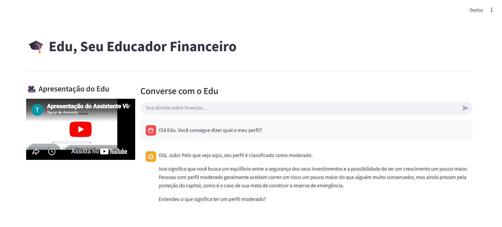

# 🤖 Edu - Agente Financeiro Inteligente com IA Generativa

## Evidência da execução



## 🎥 Apresentação do Projeto
A interface da aplicação conta com uma seção dedicada à apresentação do projeto através de um vídeo explicativo de 3 minutos. Para garantir a melhor experiência de uso e interface, o player foi integrado na área principal utilizando um layout moderno de colunas (`st.columns`). Esta abordagem garante o espaço horizontal necessário para que o navegador ative nativamente todos os controles de mídia, incluindo o ajuste de volume e o botão de **Tela Cheia (Full Screen)**.

> 🌐 **Nota sobre o vídeo:** O vídeo de demonstração está integrado diretamente no código fonte através do link oficial do YouTube, dispensando a necessidade de arquivos locais pesados no repositório.


## 📌 Contexto e Caso de Uso
O **Edu** é um educador financeiro inteligente e didático projetado para ajudar o cliente João a compreender seus hábitos de consumo e organizar suas finanças pessoais. Em vez de apenas responder perguntas genéricas, o Edu utiliza a base de dados real do cliente para contextualizar gastos, alertar sobre despesas elevadas (como alimentação) e direcionar o usuário para objetivos práticos, como a construção da sua reserva de emergência.

---

## 🛠️ Evolução da Arquitetura e Diferenciais Técnicos
Inicialmente, o projeto previa a utilização de modelos locais via Ollama. Visando aproximar a aplicação de um cenário real de produção e alta escalabilidade, a arquitetura foi modernizada:
* **Cérebro na Nuvem:** Migração para a API oficial do Google AI Studio utilizando o modelo **Gemini 2.5 Flash**, reduzindo drasticamente a latência e o uso de hardware local.
* **Segurança e Anti-alucinação:** Engenharia de prompt robusta que impede desvios de escopo (ex: o agente se recusa educadamente a passar a previsão do tempo) e proíbe a recomendação de investimentos específicos.
* **Resiliência:** Implementação de tratamento de exceções (`try/except`) para capturar de forma amigável estouros de cota da API (como o erro `429 RESOURCE_EXHAUSTED`).
* **Tratamento de Dados:** Correção de codificação de texto (`encoding='utf-8'`) nas bases de dados em português e blindagem da interface Streamlit para exibição perfeita de caracteres monetários (`R$`).

---

## 📁 Estrutura do Repositório

```text
EDU/
├── 📁 data/                          # Base de Conhecimento (Dados do Cliente)
│   ├── historico_atendimento.csv     # Atendimentos anteriores
│   ├── perfil_investidor.json        # Perfil e metas do João
│   ├── produtos_financeiros.json     # Produtos disponíveis
│   └── transacoes.csv                # Histórico de transações financeiras
├── 📁 docs/                          # Documentação das etapas do curso
│   ├── 01-documentacao-agente.md
│   ├── 02-base-conhecimento.md
│   ├── 03-prompts.md
│   ├── 04-metricas.md
│   └── 05-pitch.md
├── 📁 src/                           # Código Fonte
│   ├── app.py                        # Aplicação principal (Layout em colunas com integração do vídeo)
│   └── testar_gemini.py              # Script de teste de conexão
├── 📄 .env                           # Chave de API protegida (não versionada)
├── 📄 .gitignore                     # Filtros do Git
├── 📄 evidencia-execucao.png         # Captura de tela do sistema em funcionamento
├── 📄 README.md                      # Documentação principal do projeto
└── 📄 requirements.txt               # Dependências de bibliotecas do Python

```

## 🚀 Como Executar a Aplicação

### 1. Clonar o repositório e acessar a pasta:

git clone https://github.com/tarsoa/Edu.git
cd Edu


### 2. Configurar as Variáveis de Ambiente:
Crie um arquivo chamado .env na raiz do projeto e adicione a sua chave do Google AI Studio:

GEMINI_API_KEY=sua_chave_aqui

### 3. Instalar as Dependências:
Utilize o gerenciador de pacotes para instalar todos os pré-requisitos listados no requirements.txt:

pip install -r requirements.txt


### 4. Rodar o Chatbot:
Execute o servidor local do Streamlit:

streamlit run src/app.py


## 📊 Observabilidade e Métricas
- Latência: Reduzida a milissegundos devido ao processamento distribuído na nuvem do Google.

- Custos: Otimizados utilizando a camada gratuita (Free Tier) de prototipagem do Gemini.

- Logs de Erro: Capturados diretamente via console do Python, garantindo estabilidade e impedindo o travamento da interface visual.

---


